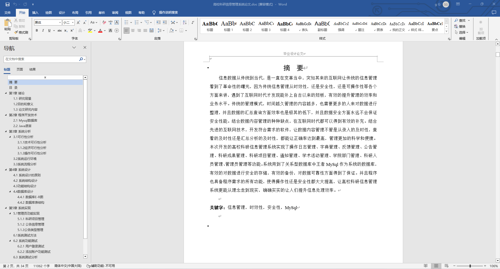
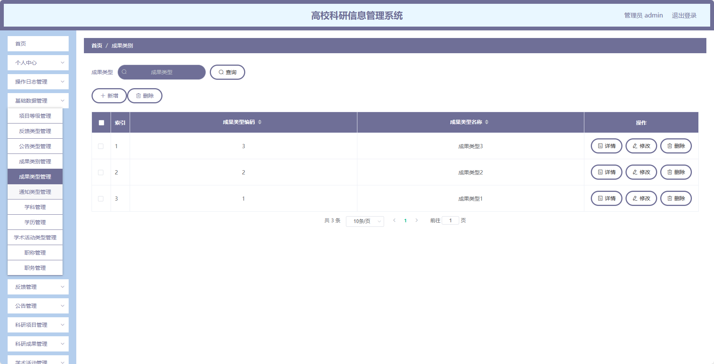
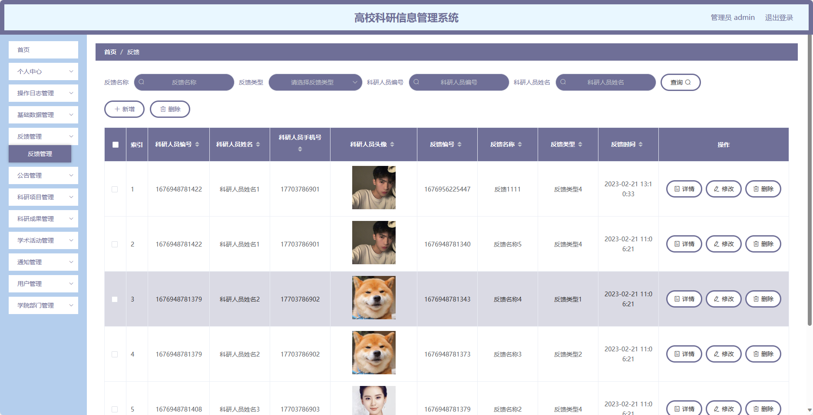
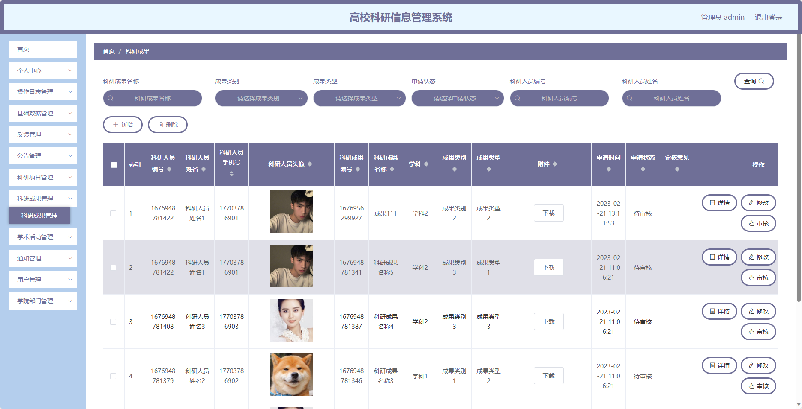
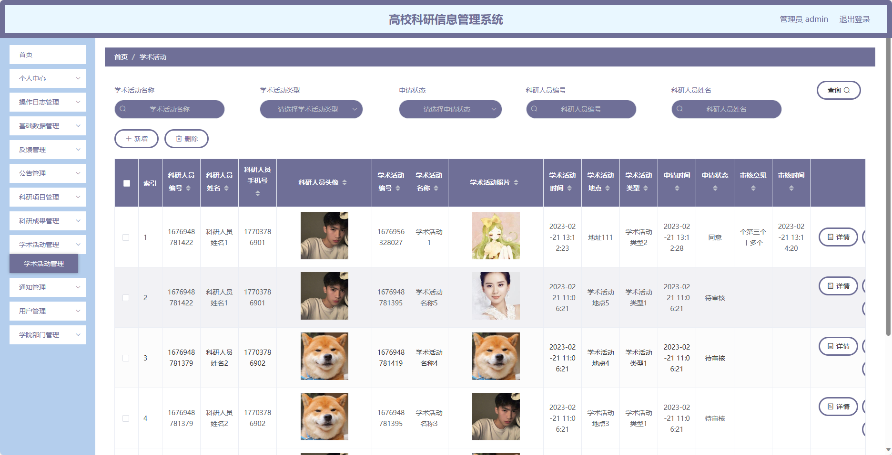
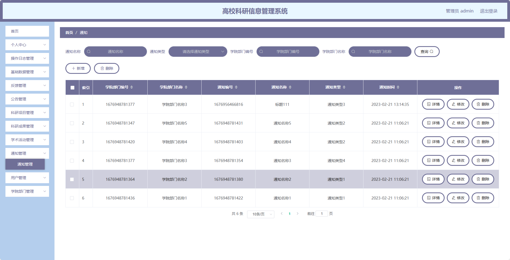
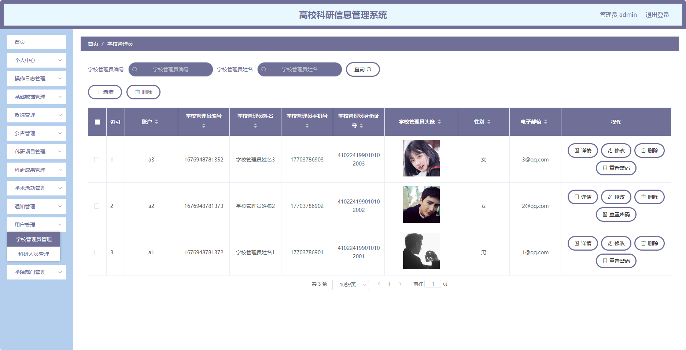
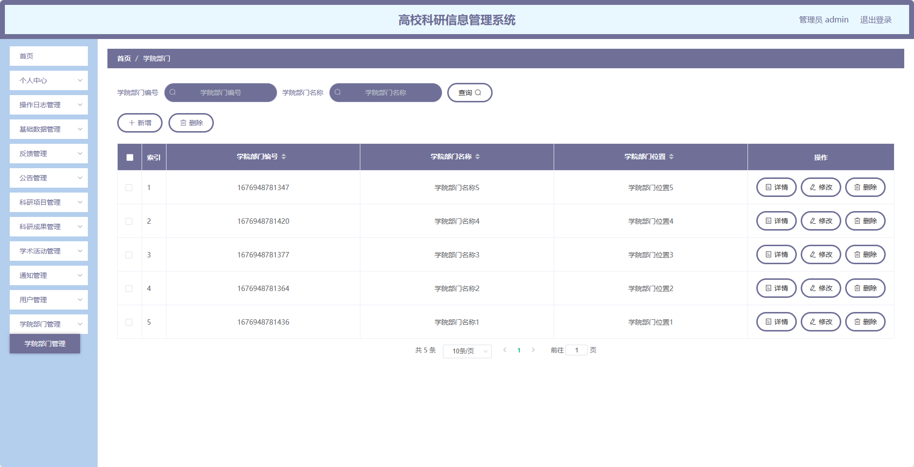
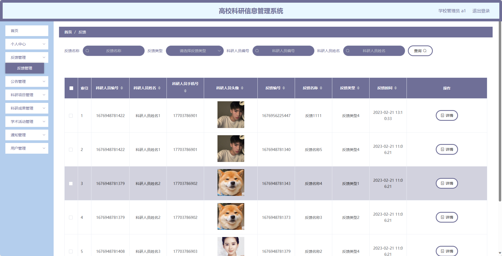

## 基于SpringBoot的高校科研信息管理系统(程序+报告)

###  获取sql数据库文件: 从戎源码网 (https://armycodes.com/) QQ: 386869957 QQ群: 377586148
###  所有系统地址: (https://github.com/YuLin-Coder/AllProjectCatalog) 
###  所有项目以及源代码本人均调试运行无问题 可支持远程安装部署调试、定制修改、代码讲解

## 项目介绍
基于SpringBoot的高校科研信息管理系统，系统包含两种角色：管理员、用户,主要功能如下。

### 【管理员】:
- 个人中心：管理个人信息，包括修改密码、查看个人资料等。
- 操作日志管理：记录管理员的操作日志。
- 基础数据管理：管理系统的基础数据，包括项目等级、反馈类型、公告类型等的添加、编辑、删除等操作。
- 反馈管理：管理用户的反馈信息，包括查看、回复反馈等操作。
- 公告管理：管理公告的发布和编辑等操作。
- 科研项目管理：管理科研项目的信息，包括添加、编辑、删除科研项目等操作。
- 科研成果管理：管理科研成果的信息，包括添加、编辑、删除科研成果等操作。
- 学术活动管理：管理学术活动的信息，包括添加、编辑、删除学术活动等操作。
- 通知管理：管理与科研相关的通知信息，包括添加、编辑、删除通知等操作。
- 用户管理：管理用户的信息，包括添加、编辑、删除用户账号等操作。
- 学院部门管理：管理学院部门的信息，包括添加、编辑、删除学院部门等操作。

### 学校管理员：
- 个人中心：管理个人信息，包括修改密码、查看个人资料等。
- 反馈管理：管理用户的反馈信息，包括查看、回复反馈等操作。
- 公告管理：管理公告的发布和编辑等操作。
- 科研项目管理：管理科研项目的信息，包括添加、编辑、删除科研项目等操作。
- 科研成果管理：管理科研成果的信息，包括添加、编辑、删除科研成果等操作。
- 学术活动管理：管理学术活动的信息，包括添加、编辑、删除学术活动等操作。
- 通知管理：管理与科研相关的通知信息，包括添加、编辑、删除通知等操作。
- 用户管理：管理用户的信息，包括添加、编辑、删除用户账号等操作。
- 学院部门管理：管理学院部门的信息，包括添加、编辑、删除学院部门等操作。

### 科研人员：
- 个人中心：管理个人信息，包括修改密码、查看个人资料等。
- 反馈管理：管理用户的反馈信息，包括查看、回复反馈等操作。
- 公告管理：管理公告的发布和编辑等操作。
- 科研项目管理：管理科研项目的信息，包括添加、编辑、删除科研项目等操作。
- 科研成果管理：管理科研成果的信息，包括添加、编辑、删除科研成果等操作。
- 学术活动管理：管理学术活动的信息，包括添加、编辑、删除学术活动等操作。
- 通知管理：管理与科研相关的通知信息，包括添加、编辑、删除通知等操作。
- 学院部门管理：管理学院部门的信息，包括添加、编辑、删除学院部门等操作。

### 【前台】:
1. 首页：展示科研相关信息和公告。
2. 反馈：用户可以提交反馈意见或问题。
3. 公告：展示学校或科研相关的公告信息。
4. 科研项目：展示科研项目的详细信息，包括项目名称、负责人等。
5. 科研成果：展示科研成果的详细信息，包括成果名称、作者等。
6. 学术活动：展示学术活动的详细信息，包括活动名称、举办时间等。
7. 通知：展示与科研相关的通知信息。
8. 用户管理：管理员可以管理用户的信息，包括添加、编辑、删除用户账号等操作。
9. 学院部门管理：管理员可以管理学院部门的信息，包括添加、编辑、删除学院部门等操作。

## 项目技术
- 编程语言：Java
- 数据库：MySQL
- 项目管理工具：Maven
- 前端技术：HTML、CSS、JavaScript、Jquery、Vue
- 后端技术：Spring、SpringMVC、MyBatis

## 运行环境
- JDK版本：JDK1.8及以上
- 开发工具：IDEA、Ecplise、Myecplise都可以
- 数据库: MySQL5.7及以上
- Maven：maven3.0及以上
- Node：14.14.0及以上

## 运行截图

